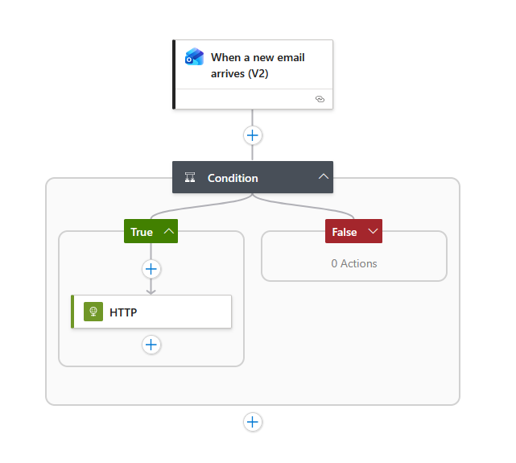
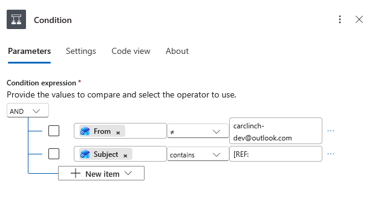
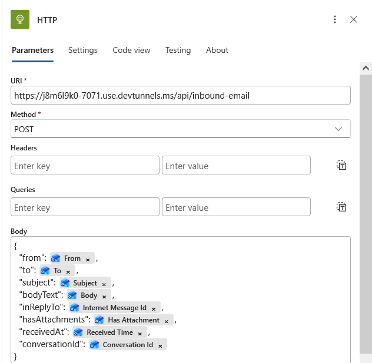

# Email Intake Service
This handles inbound email replies to emails we send out via an ACS sender address (Email Communication Services).
Replies are routed via a Logic App monitoring `carclinch-dev@outlook.com` → HTTP POST to this function.
## Prerequisites
- Login: `carclinch-dev@outlook.com`
- Outbound ACS emails must have `Reply-To: carclinch-dev@outlook.com` set so replies land in that mailbox
## Testing Function
```bash
curl -X POST http://localhost:7071/api/inbound-email \
  -H "Content-Type: application/json" \
  -d '{
    "from": "test@gmail.com",
    "to": "carclinch-dev@outlook.com",
    "subject": "Re. Inquiry about 2021 Toyota Camry",
    "bodyText": "Thanks for reaching out!",
    "inReplyTo": "<your-message-id>",
    "hasAttachments": false,
    "receivedAt": "2024-01-15T10:30:00Z"
  }'
```
## Testing w/ Logic App
### Create ACS resource
```bash
# login
az login
az group create --name rg-carclinch --location canadacentral
az communication create \
    --name acs-carclinch \
    --resource-group rg-carclinch \
    --location global \
    --data-location Canada
```
#### Create a domain
```bash
# create the Email Communication Services resource
az communication email create \
  --name acs-carclinch-email \
  --resource-group rg-carclinch \
  --location global \
  --data-location Canada
az communication email domain create \
  --name AzureManagedDomain \
  --email-service-name acs-carclinch-email \
  --resource-group rg-carclinch \
  --location global \
  --domain-management AzureManaged
```
#### Connect domain to ACS
Can't do it by CLI bc of permissions, sooo...

ACS resource → Email → Domains → Connect domain → [select everything you just made] → Connect

#### Get env variable

```bash
# ACS connection string
az communication list-key \
  --name acs-carclinch \
  --resource-group rg-carclinch \
  --query primaryConnectionString \
  --output tsv

# sender address (the AzureManagedDomain email address)
az communication email domain show \
  --name AzureManagedDomain \
  --email-service-name acs-carclinch-email \
  --resource-group rg-carclinch \
  --query mailFromSenderDomain \
  --output tsv
```

Set the above to ACS_CONNECTION_STRING and SENDER_ADDRESS respectively

### Configure Local Function
Set up Venv with all dependencies in `requirements.txt`
```bash
func start
# Function will be at http://localhost:7071/api/inbound-email
```
### Expose Function w/ Dev Tunnel (skip this if you are deploying Function to Azure)

#### Install Dev Tunnel (one time)
https://learn.microsoft.com/en-us/azure/developer/dev-tunnels/get-started?tabs=windows
```bash
# Windows
winget install Microsoft.devtunnel

# macOS
brew install --cask devtunnel

# Linux
curl -sL https://aka.ms/DevTunnelCliInstall | bash
```

#### Login (one time)
```bash
devtunnel user login
# opens browser to sign in with your Microsoft account
```

#### Create persistent tunnel (one time; URL stays stable across restarts)
```bash
devtunnel create acs-tunnel-carclinch --allow-anonymous
devtunnel port create acs-tunnel-carclinch --port-number 7071 --protocol https
```

#### Host tunnel (run this every dev session)
```bash
devtunnel host acs-tunnel-carclinch
# URL will be something like: https://acs-tunnel-carclinch-xxxx.devtunnels.ms
```

#### Restart devtunnel

```bash
devtunnel delete acs-tunnel-carclinch
devtunnel create acs-tunnel-carclinch --allow-anonymous
devtunnel port create acs-tunnel-carclinch --port-number 7071 --protocol https
devtunnel host acs-tunnel-carclinch
```

### Set Up Logic App

In the Azure Portal, create a new Logic App (Consumption) in `rg-carclinch`.
#### Trigger: When a new email arrives
- Connector: Office 365 Outlook
- Mailbox: `carclinch-dev@outlook.com`
- Folder: Inbox

The JSON raw input looks like below:
```json
{
    "Id": "AQMkADAwATM0MDAAMi1hMzYyLTc0NAA3LTAwAi0wMAoARgAAA8FPZL_p3bZEkM5mas9wHRMHABr5qNM9OUVCq8uG4K7oKWAAAAIBDAAAABr5qNM9OUVCq8uG4K7oKWAAAAADRMYeAAAA",
    "DateTimeReceived": "2026-02-24T18:26:43+00:00",
    "HasAttachment": false,
    "InternetMessageId": "<CY4PR05MB36394ECD2E0E111E041D6856C574A@CY4PR05MB3639.namprd05.prod.outlook.com>",
    "Subject": "Re: Test inbound reply flow",
    "BodyPreview": "testing\r\n________________________________\r\nFrom: DoNotReply <DoNotReply@a5d7ddf8-cc54-462c-bc41-c43246a2376f.ca2.azurecomm.net>\r\nSent: Tuesday, February 24, 2026 1:19 PM\r\nTo: alice.j.yang <alice.j.yang@outlook.com>\r\nSubject: Test inbound reply flow\r\n\r\nPle",
    "Importance": 1,
    "ConversationId": "AQQkADAwATM0MDAAMi1hMzYyLTc0NAA3LTAwAi0wMAoAEADvRuimSAQKTa2AyLNi4FxK",
    "IsRead": false,
    "IsHtml": true,
    "From": "alice.j.yang@outlook.com",
    "To": "carclinch-dev@outlook.com",
    "Cc": null,
    "Bcc": null,
    "ReplyTo": null,
    "Attachments": [],
    "body": "<html><head>\r\n<meta http-equiv=\"Content-Type\" content=\"text/html; charset=utf-8\"><style type=\"text/css\" style=\"display:none\">\r\n<!--\r\np\r\n\t{margin-top:0;\r\n\tmargin-bottom:0}\r\n-->\r\n</style></head><body dir=\"ltr\"><div class=\"elementToProof\" style=\"font-family:Aptos,Aptos_EmbeddedFont,Aptos_MSFontService,Calibri,Helvetica,sans-serif; font-size:12pt; color:rgb(0,0,0)\">testing</div><div id=\"appendonsend\"></div><hr tabindex=\"-1\" style=\"display:inline-block; width:98%\"><div id=\"divRplyFwdMsg\" dir=\"ltr\"><font face=\"Calibri, sans-serif\" color=\"#000000\" style=\"font-size:11pt\"><b>From:</b> DoNotReply &lt;DoNotReply@a5d7ddf8-cc54-462c-bc41-c43246a2376f.ca2.azurecomm.net&gt;<br><b>Sent:</b> Tuesday, February 24, 2026 1:19 PM<br><b>To:</b> alice.j.yang &lt;alice.j.yang@outlook.com&gt;<br><b>Subject:</b> Test inbound reply flow</font> <div>&nbsp;</div></div><div class=\"BodyFragment\"><font size=\"2\"><span style=\"font-size:11pt\"><div class=\"PlainText\">Please reply to this email to test inbound handling.<br></div></span></font></div></body></html>"
}
```
#### Condition: Is this a reply to a Carclinch email?
Add two rows combined with **And**:

**Row 1:**

- Left: (Dynamic content) Subject
- Dropdown: contains
- Right: [REF:

**Row 2:**

- Left: (Dynamic content) From
- Dropdown: is not equal to
- Right: carclinch-dev@outlook.com (ignore emails from yourself)

If conditions not met -> Terminate (ignore unsolicited emails or replies to other services)
#### Action: HTTP POST to function
- Method: POST
- URI: `https://acs-tunnel-carclinch-xxxx.devtunnels.ms/api/inbound-email` (replace with your tunnel URL)
- Body:
```json
{
    "from": "@triggerBody()?['From']",
    "to": "@triggerBody()?['To']",
    "subject": "@triggerBody()?['Subject']",
    "bodyText": "@triggerBody()?['Body']",
    "inReplyTo": "@triggerBody()?['InternetMessageId']",
    "hasAttachments": "@triggerBody()?['HasAttachment']",
    "receivedAt": "@triggerBody()?['DateTimeReceived']",
    "conversationId": "@triggerBody()?['ConversationId']"
}
```



### Send test email
Use the E2E Docker Compose file in infra/local OR `send_test.py` script.
```bash
py send_test.py
```
Then reply to the email that arrives in your `RECIPIENT_ADDRESS` inbox and view the `func start` terminal for logs like:
```bash
[2024-01-15T10:30:01.235] Inbound email | From: you@gmail.com | Subject: Re: Test inbound reply flow | InReplyTo: <original-message-id>
[2024-01-15T10:30:01.890] Processing reply to message: <original-message-id>
```
and from devtunnel terminal like:
```bash
POST /api/inbound-email
200 OK  52ms
```
### Delete resources
Don't forget to disable or delete the Logic App when done so it doesn't fire on real emails while you're testing!